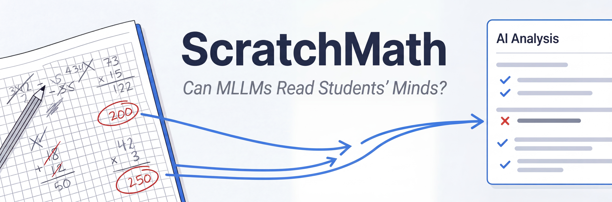
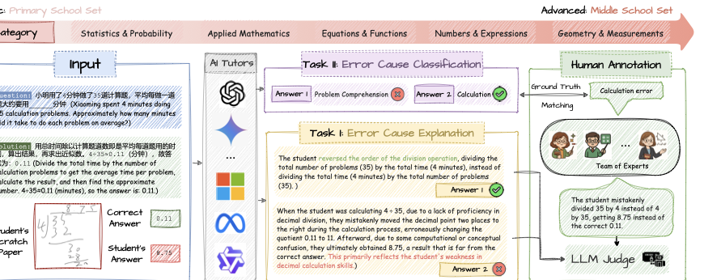

<div align="center">



### *Can MLLMs Read Students' Minds?* Unpacking Multimodal Error Analysis in Handwritten Math

**AIED 2026** &mdash; 27th International Conference on Artificial Intelligence in Education

[Dingjie Song](https://bbsngg.github.io)<sup>1</sup>,
Tianlong Xu<sup>2</sup>,
Yi-Fan Zhang<sup>4</sup>,
Hang Li<sup>5</sup>,
Zhiling Yan<sup>1</sup>,
Xing Fan<sup>3</sup>,
Haoyang Li<sup>3</sup>,
Lichao Sun<sup>1</sup>,
Qingsong Wen<sup>2,&dagger;</sup>

<sup>1</sup>Lehigh University &nbsp;
<sup>2</sup>Squirrel Ai Learning (USA) &nbsp;
<sup>3</sup>Squirrel Ai Learning (China) &nbsp;
<sup>4</sup>Chinese Academy of Sciences &nbsp;
<sup>5</sup>Michigan State University

<sup>&dagger;</sup>Corresponding author

[](https://bbsngg.github.io/ScratchMath/)
[](paper/ScratchMath_AIED2026.pdf)
[](https://huggingface.co/datasets/songdj/ScratchMath)
[](LICENSE)

</div>

<p align="center">
  
</p>

## ✨ Highlights

- 🎯 **Novel Task** &mdash; First benchmark targeting *error diagnosis* in authentic student handwritten scratchwork, shifting from the "examinee" to the "examiner" perspective.
- 📝 **Real-World Data** &mdash; 1,720 samples from Chinese primary & middle school students, meticulously annotated via human-machine collaboration.
- 🔀 **Two Complementary Tasks** &mdash; Error Cause Explanation (ECE) + Error Cause Classification (ECC) across 7 error types.
- 📊 **Comprehensive Evaluation** &mdash; 16 leading MLLMs benchmarked; best model (o4-mini) reaches **57.2%** vs. human experts at **83.9%**.

---

## 📖 Overview

**ScratchMath** evaluates whether Multimodal Large Language Models (MLLMs) can analyze handwritten mathematical scratchwork produced by real students. Unlike existing math benchmarks that focus on problem-solving, ScratchMath targets **error diagnosis** &mdash; identifying what type of mistake a student made and explaining why.

<table>
<tr>
<td width="50%" valign="top">

### 💬 Error Cause Explanation (ECE)
Given a math problem, correct answer, reference solution, the student's incorrect answer, and an image of handwritten scratchwork, generate a **free-form explanation** of the student's error.

**Metric:** LLM-as-a-Judge (o3-mini, 88.6% human agreement)

</td>
<td width="50%" valign="top">

### 🏷️ Error Cause Classification (ECC)
Using the same inputs, classify the error into one of **7 categories**:

| Category | English |
|----------|---------|
| 计算错误 | Calculation Error |
| 题目理解错误 | Comprehension Error |
| 知识点错误 | Knowledge Gap Error |
| 答题技巧错误 | Strategy Error |
| 手写誊抄错误 | Transcription Error |
| 逻辑推理错误 | Reasoning Error |
| 注意力与细节错误 | Attention Error |

**Metric:** Weighted-average accuracy

</td>
</tr>
</table>

---

## 📦 Dataset

The dataset is hosted on HuggingFace: **[songdj/ScratchMath](https://huggingface.co/datasets/songdj/ScratchMath)**

| Subset | Samples | Grades | Description |
|--------|---------|--------|-------------|
| `primary` | 1,479 | 1 &ndash; 6 | Primary school math |
| `middle` | 241 | 7 &ndash; 9 | Middle school math |

Each sample contains: `question_id`, `question`, `answer`, `solution`, `student_answer`, `student_scratchwork` (image), `error_category`, `error_explanation`.

```python
from datasets import load_dataset

# Load primary school subset
ds = load_dataset("songdj/ScratchMath", "primary", split="train")
print(ds[0]["question"], ds[0]["error_explanation"])
```

---

## 🏆 Leaderboard

Performance of state-of-the-art MLLMs on ScratchMath:

| Rank | Model | #Params | ECE Primary | ECE Middle | ECC Primary | ECC Middle | Avg |
|:----:|-------|:-------:|:-----------:|:----------:|:-----------:|:----------:|:---:|
| 👤 | *Human Expert* | *&mdash;* | *93.2* | *89.0* | *80.1* | *73.4* | *83.9* |
| 🥇 | o4-mini | &mdash; | **71.8** | **69.7** | **40.1** | 47.3 | **57.2** |
| 🥈 | Gemini 2.0 Flash Thinking | &mdash; | 65.9 | 61.0 | 43.9 | 47.3 | 54.5 |
| 🥉 | Gemini 2.0 Flash | &mdash; | 52.2 | 46.9 | 38.6 | **49.0** | 46.7 |
| 4 | Qwen2.5-VL | 72B | 40.0 | 34.0 | 32.5 | 49.4 | 39.0 |
| 5 | QVQ | 72B | 57.5 | 56.8 | 12.7 | 17.0 | 36.0 |
| 6 | Gemma-3 | 27B | 38.9 | 26.1 | 32.2 | 46.1 | 35.8 |
| 7 | Skywork-R1V | 38B | 37.5 | 33.6 | 27.7 | 43.2 | 35.5 |
| 8 | GPT-4o | &mdash; | 47.7 | 44.8 | 26.1 | 22.0 | 35.2 |
| 9 | InternVL2.5 | 78B | 27.1 | 24.5 | 30.7 | 44.8 | 31.8 |

> **Bold** = best per column. *Italic* = human performance. Full results (16 models) in the [paper](paper/ScratchMath_AIED2026.pdf).

---

## 🚀 Quick Start

### Installation

```bash
git clone https://github.com/ai-for-edu/ScratchMath.git
cd ScratchMath
pip install -r requirements.txt
```

### Run ECE Evaluation

```bash
export OPENAI_API_KEY="your-key"

# Generate error explanations
python -m eval.run_ece \
    --model gpt-4o \
    --subset primary \
    --output results/ece_gpt4o_primary.jsonl

# Judge with LLM-as-a-Judge
python -m eval.judge_ece \
    --predictions results/ece_gpt4o_primary.jsonl \
    --judge-model o3-mini \
    --output results/ece_gpt4o_primary_judged.jsonl
```

### Run ECC Evaluation

```bash
python -m eval.run_ecc \
    --model gpt-4o \
    --subset primary \
    --output results/ecc_gpt4o_primary.jsonl
```

<details>
<summary><b>🔧 Using Open-Source Models (via vLLM)</b></summary>

```bash
# Start vLLM server
vllm serve Qwen/Qwen2.5-VL-7B-Instruct

# Run evaluation
python -m eval.run_ece \
    --model Qwen/Qwen2.5-VL-7B-Instruct \
    --subset primary \
    --output results/ece_qwen25vl_primary.jsonl \
    --api-base http://localhost:8000/v1 \
    --api-key dummy
```
</details>

---

## 📄 Citation

If you find this work useful, please cite:

```bibtex
@inproceedings{song2026scratchmath,
  title     = {Can MLLMs Read Students' Minds? Unpacking Multimodal Error
               Analysis in Handwritten Math},
  author    = {Song, Dingjie and Xu, Tianlong and Zhang, Yi-Fan and Li, Hang
               and Yan, Zhiling and Fan, Xing and Li, Haoyang and Sun, Lichao
               and Wen, Qingsong},
  booktitle = {Proceedings of the 27th International Conference on Artificial
               Intelligence in Education (AIED)},
  year      = {2026}
}
```

## ⚖️ License

This project is licensed under [CC BY 4.0](https://creativecommons.org/licenses/by/4.0/).
